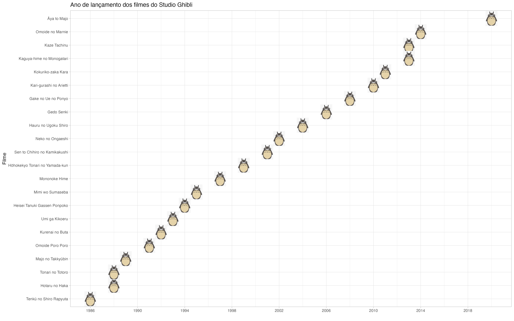
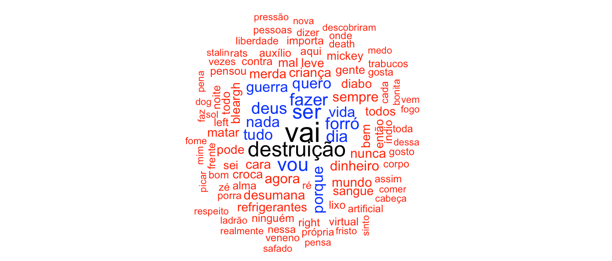
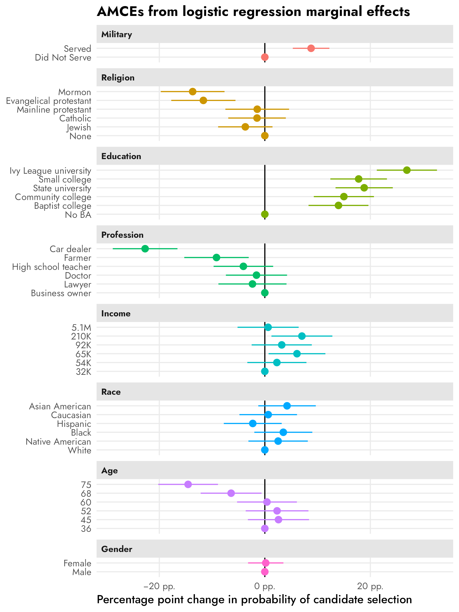
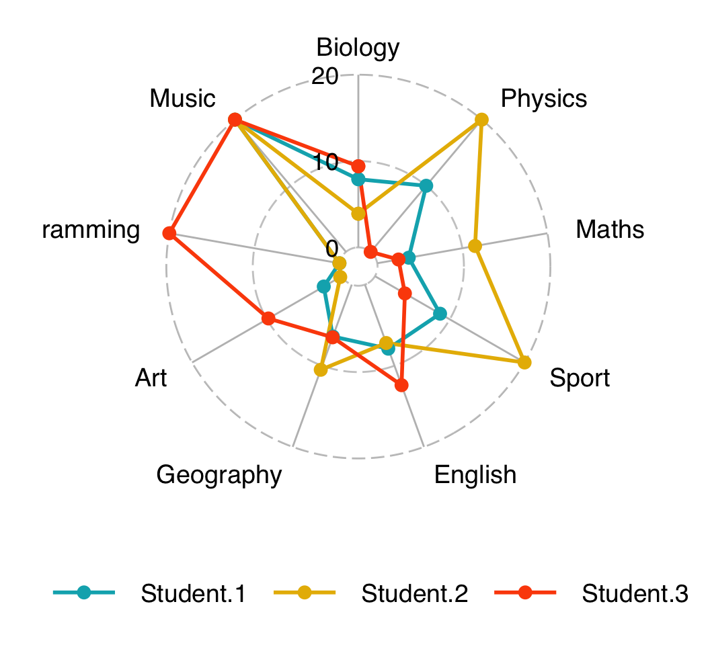

class: middle, center, inverse

# Análise descritiva dos dados:<br>funções, tabelas e gráficos

.large[### Curso de Bioestatística com R]

*****

#### <br><br><br>Ornella Scardua Ferreira
#### `r fontawesome::fa("square-envelope", fill = "#f4f4f4")` [ornscar@gmail.com](ornscar@gmail.com) `r fontawesome::fa("github", fill = "#f4f4f4")` [@ornscar](https://github.com/ornscar) `r fontawesome::fa("twitter", fill = "#f4f4f4")` [@ornscar](https://twitter.com/ornscar) 

```{r setup, include=FALSE}
options(htmltools.dir.version = FALSE)
```

```{r xaringan-extra, include=FALSE, warning=FALSE}
xaringanExtra::use_clipboard()
```

```{r xaringan-themer, include=FALSE, warning=FALSE}
library(xaringanthemer)

blue <- "#0000cd"
offw <- "#F4F4F4"
gray <- "#333333"
green <- "#58B30D"

style_duo(
  # colors
  primary_color = offw,
  secondary_color = blue,
  header_color = gray,
  text_color = gray,
  code_inline_color = colorspace::lighten(gray),
  text_bold_color = colorspace::lighten(gray),
  link_color = green,
  title_slide_text_color = green,
  # fonts
  header_font_google = google_font("Martel", "300", "400"),
  text_font_google = google_font("Lato"),
  code_font_google = google_font("Fira Mono")
)
```

---
class: middle, center, partial-bg

.pull-left[
### Sobre mim

```{r echo=FALSE, fig.align ='center', out.width="75%"}

```
]

.pull-right[
<br><br><br><br><br><br><br>
<font color="#FFF5F4"><em>Amo gráficos como amo cavalos. Gosto de música ruim e de cinema (bom). Sou apaixonada pelo Botafogo e pelo Bayern de Munique. Prefiro Vila Velha a qualquer lugar no mundo. Não tenho sonhos, mas um dia espero ver a Palestina livre.</font></em>
]

---

### Cronograma

.pull-left[
#### **1. Dados**

- Base 1: dados sobre gestantes diagnosticadas com diabetes gestacional.

- Base 2: dados do Programa das Nações Unidas para o Desenvolvimento (PNUD).

#### **2. Funções bases do** `r fontawesome::fa("r-project", fill = "#333333")`

- Frequência relativa e absoluta.

- Medidas-resumo: medidas de posição e de dispersão.

#### **3. Tabelas descritivas** 

- O pacote `{gtsummary}.`

- Tabelas com frequências relativas e absolutas e medidas-resumos.
]

.pull-right[
#### **4. Gráficos**

- O pacote `{ggplot2}`.

- Gráficos univariados: barras e histogramas.
    
- Gráficos bivariados:

    - Variáveis qualitativas x qualitativas: barras agrupadas e empilhadas.
    
    - Variáveis quantitativas x quantitativas: dispersão.
    
    - Variáveis qualitativas x quantitativas: linhas e _boxplot_.
]

---
class: middle, center, inverse

## Os dados

---

### Base 1

- A base de dados é sobre **gestantes diagnosticadas com diabetes gestacional** que realizaram o pré-natal entre os anos de 2012 a 2015 no Hospital das Clínicas da Universidade de São Paulo.

- Contém **408 observações** e **8 variáveis**, a saber:

> `ano`: ano em que a gestante realizou o pré-natal;

> `idade`: idade da gestante;

> `cor`: Tabagista da gestante;

> `n_gestacoes`: número de gestações anteriores;

> `imc_classe`: IMC categórico;

> `hb_glicada`: exame de hemoglobina glicada categórico;

> `glicemia_jejum`: valor do exame de glicemia de jejum (em mg/dL);

> `insulina`: se a gestante precisou usar insulina antes do parto.
    
---

- No `r fontawesome::fa("r-project", fill = "#333333")`:

```{r echo=TRUE}
# carregando os dados
dados1 <- readxl::read_xlsx("dados/diabetes.xlsx")

# panorama da base de dados
dplyr::glimpse(dados1)
```

---

### Base 2

- Base de dados do **PNUD** cujas informações socioeconômicas são dos anos de 2012 a 2021 a nível Brasil, Unidade Federativa (UF) e região metropolitana.
    
- Contém **490 observações** e **5 variáveis**, a saber:

> `ano`: ano de análise dos indicadores;

> `agregacao`: nível nacional, estadual e região metropolitana;

> `nome`: nome da UF e região metropolitana;

> `gini`: Índice de Gini;

> `espvida`: expectativa de vida, em anos.
    
---

- No `r fontawesome::fa("r-project", fill = "#333333")`:

```{r echo=TRUE}
# carregando os dados
dados2 <- readxl::read_xlsx("dados/pnud.xlsx")

# panorama da base de dados
dplyr::glimpse(dados2)
```

---
class: middle, center, inverse

## Funções bases do `r fontawesome::fa("r-project", fill = "#f4f4f4")`

---

### Frequência absoluta e relativa

#### Frequência absoluta

```{r echo=TRUE}
# frequencia absoluta da va 'hac' sem considerar na
freq_abs <- table(dados1$hac); freq_abs

# frequencia absoluta da va 'hac' considerando na
freq_abs_na <- table(dados1$hac, useNA = "always"); freq_abs_na
```

---

#### Frequência relativa

```{r echo=TRUE}
# frequencia relativa da va 'hac' sem considerar na
prop.table(freq_abs)

# frequencia relativa da va 'hac' considerando na
prop.table(freq_abs_na)
```

<br>
<div class="callout-tip">
<b>Dica!</b><br><br>Use a função round() para arredondar os valores. Por exemplo, round(prop.table(freq_abs), 2).
</div>

---

### Medidas de posição

#### Valores mínimo e máximo

```{r echo=TRUE}
# valor minimo das vas 'idade' e 'expectativa de vida'
min(dados1$idade); min(dados2$espvida)

# valor maximo da va 'expectativa de vida'
max(dados1$idade); max(dados2$espvida)
```

<br>
<div class="callout-note">
<b>Observação!</b><br><br>Se a variável tem NA, é necessário incluir o argumento na.rm = TRUE. Por exemplo, min(dados1$idade, na.rm = TRUE).
</div>

---

#### Moda

```{r echo=TRUE}
# funcao para calcular moda
calc_moda <- function(x, na.rm = TRUE) {
  if (na.rm) {                              # se tiver na, 
    x <- x[!is.na(x)]                       # filtra valores diferentes de na
  }
  freq <- table(x)                          # calcula as frequencias
  moda <- names(freq)[freq == max(freq)]    # encontrao valor mais frequente
  return(type.convert(moda, as.is = TRUE))  # mantem o tipo da variavel
}

# moda da va 'expectativa de vida'
calc_moda(dados2$espvida)
```

<br>
<div class="callout-note">
<b>Observação!</b><br><br>Nesse caso, não é necessário usar o argumento na.rm = TRUE porque os NAs da variável já são desconsiderados.
</div>

---

#### Mediana

```{r echo=TRUE}
# mediana das vas 'valor do exame de glicemia de jejum' e 'indice de gini'
median(dados1$glicemia_jejum); median(dados2$gini)
```

#### Média

```{r echo=TRUE}
# media das vas 'idade' e 'indice de gini'
mean(dados1$idade); mean(dados2$gini)
```

<br>
<div class="callout-note">
<b>Observação!</b><br><br>Se necessário, utilize o argumento na.rm = TRUE.
</div>

---

#### Quartis

```{r echo=TRUE}
# quartis padrao da va 'valor do exame de glicemia de jejum'
quantile(dados1$glicemia_jejum)
```

#### Percentis

```{r echo=TRUE}
# percentis 10, 20 e 90 da va 'valor do exame de glicemia de jejum'
quantile(dados1$glicemia_jejum, probs = c(0.1, 0.2, 0.9))
```

<br>
<div class="callout-note">
<b>Observação!</b><br><br>Se necessário, utilize o argumento na.rm = TRUE.
</div>

---

### Medidas de dispersão

#### Amplitude

```{r echo=TRUE}
# amplitude da va 'idade'
max(dados1$idade) - min(dados1$idade)
```

#### Intervalo interquartil

```{r echo=TRUE}
# intervalo interquartil da va 'idade'
IQR(dados1$idade)
```

<br>
<div class="callout-note">
<b>Observação!</b><br><br>Se necessário, utilize o argumento na.rm = TRUE na função IQR().
</div>

---

#### Variância

```{r echo=TRUE}
# variancia da va 'indice de gini'
var(dados2$gini)
```

#### Desvio-padrão

```{r echo=TRUE}
# desvio-padrao da va 'indice de gini'
sd(dados2$gini)
```

#### Coeficiente de variação (CV)

```{r echo=TRUE}
(sd(dados2$gini) / mean(dados2$gini)) * 100
```

<div class="callout-note">
<b>Observação!</b><br><br>Nas funções de variância e desvio-padrão, pode-se utilizar o argumento na.rm = TRUE.
</div>

---
class: middle, center, inverse

## Tabelas descritivas

---

### O pacote `{gtsummary}`

- Criado pelo [Daniel D. Sjoberg](https://www.danieldsjoberg.com), bioestatístico do Memorial Sloan Kettering Cancer Center (EUA).

- Gera automaticamente tabelas com formatação elegante e profissional, prontas para relatórios, artigos científicos e apresentações.
    
- Repositório oficial: [https://github.com/ddsjoberg/gtsummary](https://github.com/ddsjoberg/gtsummary).

- Infinitas possibilidades de customização!

### Outros pacotes

- `{modelsummary}`: [https://modelsummary.com](https://modelsummary.com).

- `{summarytools}`: [https://cran.r-project.org/web/packages/summarytools/vignettes/introduction.html](https://cran.r-project.org/web/packages/summarytools/vignettes/introduction.html).

---

#### Tabela descritiva da Base 1

.pull-left[
```{r t1, paged.print=FALSE, eval=FALSE, echo=TRUE}
library(gtsummary)

# criando tabela gtsummary
dados1 |> 
  tbl_summary() #<<
``` 
] 

.pull-right[
```{r t1-out, ref.label="t1", out.width="90%", echo=FALSE, message=FALSE}
```
]

---

.pull-left[
```{r t2, paged.print=FALSE, eval=FALSE}
# incluindo tema a tabela
theme_gtsummary_journal(journal = "lancet")

dados1 |> 
  tbl_summary(
    # incluindo apenas as variaveis de interesse
    include = c(idade, imc_classe, n_gestacoes, hist_diab_fam, glicemia_jejum, insulina) #<<
  )
``` 
] 

.pull-right[
```{r t2-out, ref.label="t2", out.width="90%", echo=FALSE, message=FALSE}
```
]

---

.pull-left[
```{r t3, paged.print=FALSE, eval=FALSE}
dados1 |> 
  tbl_summary(
    # incluindo apenas as variaveis de interesse
    include = c(idade, imc_classe, n_gestacoes, hist_diab_fam, glicemia_jejum, insulina),
    # rotulando as variaveis
    label = list(                                            #<<  
      idade ~ "Idade (anos)",                                #<<
      imc_classe ~ "IMC",                                    #<<
      n_gestacoes ~ "N° de gestações anteriores",            #<<
      hist_diab_fam ~ "Histórico de diabetes na família",    #<< 
      glicemia_jejum ~ "Valor do exame de glicemia (mg/dL)", #<<
      insulina ~ "Usou insulina antes do parto"              #<<
    )
  )
``` 
] 

.pull-right[
```{r t3-out, ref.label="t3", out.width="90%", echo=FALSE, message=FALSE}
```
]

---

.pull-left[
```{r t4, paged.print=FALSE, eval=FALSE}
dados1 |> 
  tbl_summary(
    # incluindo apenas as variaveis de interesse
    include = c(idade, imc_classe, n_gestacoes, hist_diab_fam, glicemia_jejum, insulina),
    # rotulando as variaveis
    label = list(                                            
      idade ~ "Idade (anos)",                                
      imc_classe ~ "IMC",                                
      n_gestacoes ~ "N° de gestações anteriores",            
      hist_diab_fam ~ "Histórico de diabetes na família",    
      glicemia_jejum ~ "Valor do exame de glicemia (mg/dL)" ,
      insulina ~ "Usou insulina antes do parto"
    ),
    # calculando as medidas de interesse
    statistic = list(                                                        #<<
      all_continuous() ~ "{mean} ± {sd}", # media e dp p/ vas quantitativas  #<<
      all_categorical() ~ "{n} ({p}%)" # n e % p/ vas qualitativas           #<<
    )                                                                        #<<
  )
``` 
] 

.pull-right[
```{r t4-out, ref.label="t4", out.width="90%", echo=FALSE, message=FALSE}
```
]

---

.pull-left[
```{r t5, paged.print=FALSE, eval=FALSE}
dados1 |> 
  tbl_summary(
    # incluindo apenas as variaveis de interesse
    include = c(idade, imc_classe, n_gestacoes, hist_diab_fam, glicemia_jejum, insulina),
    # rotulando as variaveis
    label = list(                                            
      idade ~ "Idade (anos)",                                
      imc_classe ~ "IMC",                              
      n_gestacoes ~ "N° de gestações anteriores",            
      hist_diab_fam ~ "Histórico de diabetes na família",    
      glicemia_jejum ~ "Valor do exame de glicemia (mg/dL)",
      insulina ~ "Usou insulina antes do parto"
    ),
    # calculando as medidas de interesse
    statistic = list(                                                        
      all_continuous() ~ "{mean} ± {sd}", # media e dp p/ vas quantitativas  
      all_categorical() ~ "{n} ({p}%)" # n e % p/ vas qualitativas           
    ),
    # formatando numero de digitos
    digits = list(                                                  #<<
      all_continuous() ~ 2, # 2 digitos p/ vas quantitativas        #<<
      all_categorical() ~ c(0, 1) # 0 digitos p/ n e 1 digito p/ %  #<<
    )                                                               #<<
  )
``` 
] 

.pull-right[
```{r t5-out, ref.label="t5", out.width="90%", echo=FALSE, message=FALSE}
```
]

---

.pull-left[
```{r t6, paged.print=FALSE, eval=FALSE}
dados1 |> 
  tbl_summary(
    # incluindo apenas as variaveis de interesse
    include = c(idade, imc_classe, n_gestacoes, hist_diab_fam, glicemia_jejum, insulina),
    # rotulando as variaveis
    label = list(                                            
      idade ~ "Idade (anos)",                                
      imc_classe ~ "IMC",                             
      n_gestacoes ~ "N° de gestações anteriores",            
      hist_diab_fam ~ "Histórico de diabetes na família",    
      glicemia_jejum ~ "Valor do exame de glicemia (mg/dL)",
      insulina ~ "Usou insulina antes do parto"
    ),
    # calculando as medidas de interesse
    statistic = list(                                                        
      all_continuous() ~ "{mean} ± {sd}", # media e dp p/ vas quantitativas  
      all_categorical() ~ "{n} ({p}%)" # n e % p/ vas qualitativas           
    ),
    # formatando numero de digitos
    digits = list(
      all_continuous() ~ 2, # 2 digitos p/ vas quantitativas
      all_categorical() ~ c(0, 1) # 0 digitos p/ n e 1 digito p/ %
    ),
    # alterando rotulo dos valores faltantes
    missing_text = "NA" #<<
  )
``` 
] 

.pull-right[
```{r t6-out, ref.label="t6", out.width="90%", echo=FALSE, message=FALSE}
```
]

---

.pull-left[
```{r t7, paged.print=FALSE, eval=FALSE}
dados1 |> 
  tbl_summary(
    # incluindo apenas as variaveis de interesse
    include = c(idade, imc_classe, n_gestacoes, hist_diab_fam, glicemia_jejum, insulina),
    # rotulando as variaveis
    label = list(                                            
      idade ~ "Idade (anos)",                                
      imc_classe ~ "IMC",                                  
      n_gestacoes ~ "N° de gestações anteriores",            
      hist_diab_fam ~ "Histórico de diabetes na família",    
      glicemia_jejum ~ "Valor do exame de glicemia (mg/dL)",
      insulina ~ "Usou insulina antes do parto"
    ),
    # calculando as medidas de interesse
    statistic = list(                                                        
      all_continuous() ~ "{mean} ± {sd}", # media e dp p/ vas quantitativas  
      all_categorical() ~ "{n} ({p}%)" # n e % p/ vas qualitativas           
    ),
    # formatando numero de digitos
    digits = list(
      all_continuous() ~ 2, # 2 digitos p/ vas quantitativas
      all_categorical() ~ c(0, 1) # 0 digitos p/ n e 1 digito p/ %
    ),
    # alterando rotulo dos valores faltantes
    missing_text = "NA"
  ) |>
  # incluindo o numero total de observacoes validas
  add_n() #<<
```  
] 

.pull-right[
```{r t7-out, ref.label="t7", out.width="90%", echo=FALSE, message=FALSE}
```
]

---

.pull-left[
```{r t8, paged.print=FALSE, eval=FALSE}
dados1 |> 
  tbl_summary(
    # incluindo apenas as variaveis de interesse
    include = c(idade, imc_classe, n_gestacoes, hist_diab_fam, glicemia_jejum, insulina),
    # rotulando as variaveis
    label = list(                                            
      idade ~ "Idade (anos)",                                
      imc_classe ~ "IMC",                                  
      n_gestacoes ~ "N° de gestações anteriores",            
      hist_diab_fam ~ "Histórico de diabetes na família",    
      glicemia_jejum ~ "Valor do exame de glicemia (mg/dL)",
      insulina ~ "Usou insulina antes do parto"
    ),
    # calculando as medidas de interesse
    statistic = list(                                                        
      all_continuous() ~ "{mean} ± {sd}", # media e dp p/ vas quantitativas  
      all_categorical() ~ "{n} ({p}%)" # n e % p/ vas qualitativas           
    ),
    # formatando numero de digitos
    digits = list(
      all_continuous() ~ 2, # 2 digitos p/ vas quantitativas
      all_categorical() ~ c(0, 1) # 0 digitos p/ n e 1 digito p/ %
    ),
    # alterando rotulo dos valores faltantes
    missing_text = "NA"
  ) |> 
  # incluindo numero total de observacoes validas
  add_n() |> 
  # modificando os nomes do cabecalho
  modify_header(label ~ "**Variável**") #<<
``` 
] 

.pull-right[
```{r t8-out, ref.label="t8", out.width="90%", echo=FALSE, message=FALSE}
```
]

---

.pull-left[
```{r t9, paged.print=FALSE, eval=FALSE}
dados1 |> 
  tbl_summary(
    # incluindo apenas as variaveis de interesse
    include = c(idade, imc_classe, n_gestacoes, hist_diab_fam, glicemia_jejum, insulina),
    # rotulando as variaveis
    label = list(                                            
      idade ~ "Idade (anos)",                                
      imc_classe ~ "IMC",                                    
      n_gestacoes ~ "N° de gestações anteriores",            
      hist_diab_fam ~ "Histórico de diabetes na família",    
      glicemia_jejum ~ "Valor do exame de glicemia (mg/dL)",
      insulina ~ "Usou insulina antes do parto"
    ),
    # calculando as medidas de interesse
    statistic = list(                                                        
      all_continuous() ~ "{mean} ± {sd}", # media e dp p/ vas quantitativas  
      all_categorical() ~ "{n} ({p}%)" # n e % p/ vas qualitativas           
    ),
    # formatando numero de digitos
    digits = list(
      all_continuous() ~ 2, # 2 digitos p/ vas quantitativas
      all_categorical() ~ c(0, 1) # 0 digitos p/ n e 1 digito p/ %
    ),
    # alterando rotulo dos valores faltantes
    missing_text = "NA"
  ) |> 
  # incluindo numero total de observacoes validas
  add_n() |> 
  # modificando os nomes do cabecalho
  modify_header(label ~ "**Variável**") |> 
  # formatando nomes das variaveis para negrito
  bold_labels() #<<
``` 
] 

.pull-right[
```{r t9-out, ref.label="t9", out.width="90%", echo=FALSE, message=FALSE}
```
]

---

.pull-left[
```{r t10, paged.print=FALSE, eval=FALSE}
dados1 |> 
  tbl_summary(
    # analisando por grupo de desfecho
    by = insulina, #<<
    # incluindo apenas as variaveis de interesse
    include = c(idade, imc_classe, n_gestacoes, hist_diab_fam, glicemia_jejum),
    # rotulando as variaveis
    label = list(                                            
      idade ~ "Idade (anos)",                                
      imc_classe ~ "IMC",                                   
      n_gestacoes ~ "N° de gestações anteriores",            
      hist_diab_fam ~ "Histórico de diabetes na família",    
      glicemia_jejum ~ "Valor do exame de glicemia (mg/dL)"
    ),
    # calculando as medidas de interesse
    statistic = list(                                                        
      all_continuous() ~ "{mean} ± {sd}", # media e dp p/ vas quantitativas  
      all_categorical() ~ "{n} ({p}%)" # n e % p/ vas qualitativas           
    ),
    # formatando numero de digitos
    digits = list(
      all_continuous() ~ 2, # 2 digitos p/ vas quantitativas
      all_categorical() ~ c(0, 1) # 0 digitos p/ n e 1 digito p/ %
    ),
    # alterando rotulo dos valores faltantes
    missing_text = "NA"
  ) |> 
  # incluindo numero total de observacoes validas
  add_n() |> 
  # modificando os nomes do cabecalho
  modify_header(label ~ "**Variável**") |> 
  # formatando nomes das variaveis para negrito
  bold_labels()
``` 
] 

.pull-right[
```{r t10-out, ref.label="t10", out.width="90%", echo=FALSE, message=FALSE}
```
]

---

.pull-left[
```{r t11, paged.print=FALSE, eval=FALSE}
dados1 |> 
  tbl_summary(
    # analisando por grupo de desfecho
    by = insulina,
    # incluindo apenas as variaveis de interesse
    include = c(idade, imc_classe, n_gestacoes, hist_diab_fam, glicemia_jejum),
    # rotulando as variaveis
    label = list(                                            
      idade ~ "Idade (anos)",                                
      imc_classe ~ "IMC",                                
      n_gestacoes ~ "N° de gestações anteriores",            
      hist_diab_fam ~ "Histórico de diabetes na família",    
      glicemia_jejum ~ "Valor do exame de glicemia (mg/dL)"
    ),
    # calculando as medidas de interesse
    statistic = list(                                                        
      all_continuous() ~ "{mean} ± {sd}", # media e dp p/ vas quantitativas  
      all_categorical() ~ "{n} ({p}%)" # n e % p/ vas qualitativas           
    ),
    # formatando numero de digitos
    digits = list(
      all_continuous() ~ 2, # 2 digitos p/ vas quantitativas
      all_categorical() ~ c(0, 1) # 0 digitos p/ n e 1 digito p/ %
    ),
    # alterando rotulo dos valores faltantes
    missing_text = "NA"
  ) |> 
  # incluindo numero total de observacoes validas
  add_n() |> 
  # modificando os nomes do cabecalho
  modify_header(label ~ "**Variável**") |> 
  # formatando nomes das variaveis para negrito
  bold_labels() |> 
  # adicionando rótulo para estratificacao
  modify_spanning_header(c("stat_1", "stat_2") ~ "**Usou insulina antes do parto**") #<<
``` 
] 

.pull-right[
```{r t11-out, ref.label="t11", out.width="90%", echo=FALSE, message=FALSE}
```
]

---

.pull-left[
```{r t12, paged.print=FALSE, eval=FALSE}
# traduzindo a tabela para pt-br
theme_gtsummary_language("pt", big.mark = ".", decimal.mark = ",") #<<

tbl <- dados1 |> 
  tbl_summary(
    # analisando por grupo de desfecho
    by = insulina,
    # incluindo apenas as variaveis de interesse
    include = c(idade, imc_classe, n_gestacoes, hist_diab_fam, glicemia_jejum),
    # rotulando as variaveis
    label = list(                                            
      idade ~ "Idade (anos)",                                
      imc_classe ~ "IMC",                                
      n_gestacoes ~ "N° de gestações anteriores",            
      hist_diab_fam ~ "Histórico de diabetes na família",    
      glicemia_jejum ~ "Valor do exame de glicemia (mg/dL)"
    ),
    # calculando as medidas de interesse
    statistic = list(                                                        
      all_continuous() ~ "{mean} ± {sd}", # media e dp p/ vas quantitativas  
      all_categorical() ~ "{n} ({p}%)" # n e % p/ vas qualitativas           
    ),
    # formatando numero de digitos
    digits = list(
      all_continuous() ~ 2, # 2 digitos p/ vas quantitativas
      all_categorical() ~ c(0, 1) # 0 digitos p/ n e 1 digito p/ %
    ),
    # alterando rotulo dos valores faltantes
    missing_text = "NA"
  ) |> 
  # modificando os nomes do cabecalho
  modify_header(label ~ "**Variável**") |> 
  # formatando nomes das variaveis para negrito
  bold_labels() |> 
  # adicionando rótulo para estratificacao
  modify_spanning_header(c("stat_1", "stat_2") ~ "**Usou insulina antes do parto**")

tbl
``` 
] 

.pull-right[
```{r t12-out, ref.label="t12", out.width="90%", echo=FALSE, message=FALSE}
```
]

---

## Salvando uma tabela `gtsummary` no `r fontawesome::fa("r-project", fill = "#333333")`

- A tabela precisa ser do tipo `gt`. Para transformá-la nesse formato, use a função `as_gt()`, do `{gtsummary}`.

```{r}
# tranformando a tabela de gtsummary para gt
tbl <- tbl |> as_gt()
```

- Para salvar a tabela, execute a função `gtsave()`, do pacote `{gt}`.

```{r message=FALSE, warning=FALSE}
# carregando o pacote {gt}
library(gt)

# salvando imagem no formato png
gtsave(tbl, "tabelas/tbl_desc.png")

# salvando imagem no formato docx
gtsave(tbl, "tabelas/tbl_desc.docx")
```

---
class: middle, center, inverse

## Gráficos

---
class: middle, center

## No `r fontawesome::fa("r-project", fill = "#333333")`, é possível fazer...

#### (outras representações gráficas)

---
class: middle

### ... gráfico animado;

```{r echo=FALSE, fig.align ='center', out.width="65%", fig.cap='Figura 1: Gráfico animado do ano de lançamento dos filmes do Studio Ghibli.'}

```

---
class: middle

### ... gráfico de densidades;

```{r echo=FALSE, fig.align ='center', out.width="50%", fig.cap='Figura 2: Gráfico das distribuições de densidade da temperatura, por mês do ano de 2016, na cidade de Lincoln, em Nebraska/EUA.'}
knitr::include_graphics("img/ridge.png")
```

.center[
<font size=3>Fonte: <a href="https://www.datanovia.com/en/blog/elegant-visualization-of-density-distribution-in-r-using-ridgeline/">Datanovia | Elegant visualization of density distribution in R using ridgeline</a>.</font>
]

---
class: middle

### ... nuvem de palavras;

```{r echo=FALSE, fig.align ='center', out.width="80%", fig.cap='Figura 3: Nuvem de palavras das músicas da Mukeka di Rato.'}

```

---
class: middle

### ... gráfico de florestas ( _forest plot_);

```{r echo=FALSE, fig.align ='center', out.width="28%", fig.cap='Figura 4: Gráfico de floresta dos efeitos marginais médios entre candidatos, segundo condições sociodemográficas.'}

```

.center[
<font size=3>Fonte: <a href="https://www.andrewheiss.com/blog/2023/07/25/conjoint-bayesian-frequentist-guide/">Andrew Heiss | The ultimate practical guide to conjoint analysis with R</a>.</font>
]

---
class: middle

### ... gráfico de radar (ou de aranha);

```{r echo=FALSE, fig.align ='center', out.width="42%", fig.cap='Figura 5: Gráfico de radar das notas de alunos de um determinado colégio.'}

```

.center[
<font size=3>Fonte: <a href="https://www.datanovia.com/en/blog/beautiful-radar-chart-in-r-using-fmsb-and-ggplot-packages/">Datanovia | Beautiful radar chart in R using fmsb and ggplot packages</a>.</font>
]

---
class: middle

### ... arte;

```{r echo=FALSE, fig.align ='center', out.width="85%", fig.cap='Figura 6: Arte com R por Danielle Navarro (à esquerda) e Thomas Lin Pedersen (à direita).'}

```

<br><br>
.center[
<font size=3>Fonte: <a href="https://art.djnavarro.net/#pid=23">Art by Danielle Navarro</a> e <a href="https://www.data-imaginist.com/art">Data Imaginist - Visualization and beyond…</a>.</font>
]

---
class: middle, center

### ... e muito mais!

---

### O pacote `{ggplot2}`

- Criado pelo estatístico neo-zelandês [Hadley Wickham](https://hadley.nz/).

- No livro **_A layered grammar of graphics_** (em português: _"Uma gramática em camadas dos gráficos"_), Hadley define que os elementos de um gráfico (dados, cores, formas geométricas, coordenadas, anotações etc) são camadas e que um gráfico é um conjunto de sobreposições de camadas.

- Vantagens:

    - MAIS bonitos;
    - MAIS intuitivos;
    - MAIS customizáveis;
    - sintaxe MAIS padronizada.
    
- Documentação: [https://ggplot2.tidyverse.org/](https://ggplot2.tidyverse.org/).

- Cheatsheet: [https://rstudio.github.io/cheatsheets/data-visualization.pdf](https://rstudio.github.io/cheatsheets/data-visualization.pdf).

---

### Gráfico univariados

#### Gráfico de barras

.pull-left[
```{r g1, paged.print=FALSE, eval=FALSE}
library(ggplot2)

ggplot(dados1) #<<
``` 
] 

.pull-right[
```{r g1-out, ref.label="g1", out.width="90%", echo=FALSE, message=FALSE}
```
]

---

.pull-left[
```{r g2, paged.print=FALSE, eval=FALSE}
ggplot(dados1, aes(x = imc_classe)) #<<
``` 
] 

.pull-right[
```{r g2-out, ref.label="g2", echo=FALSE, message=FALSE}
```
]

---

.pull-left[
```{r g3, paged.print=FALSE, eval=FALSE}
ggplot(dados1, aes(x = imc_classe)) +
  geom_bar() #<<
``` 
] 

.pull-right[
```{r g3-out, ref.label="g3", echo=FALSE, message=FALSE}
```
]

---

.pull-left[
```{r g4, paged.print=FALSE, eval=FALSE}
ggplot(dados1, aes(x = imc_classe, y = after_stat(count)/sum(after_stat(count)))) + #<<
  geom_bar()
``` 
] 

.pull-right[
```{r g4-out, ref.label="g4", echo=FALSE, message=FALSE}
```
]

---

.pull-left[
```{r g5, paged.print=FALSE, eval=FALSE}
ggplot(dados1, aes(x = imc_classe, y = after_stat(count)/sum(after_stat(count)))) + 
  geom_bar(color = "blue", fill = "white") #<<
``` 
] 

.pull-right[
```{r g5-out, ref.label="g5", echo=FALSE, message=FALSE}
```
]

---

.pull-left[
```{r g6, paged.print=FALSE, eval=FALSE}
ggplot(dados1, aes(x = imc_classe, y = after_stat(count)/sum(after_stat(count)))) +
  geom_bar(color = "blue", fill = "white") +
  scale_y_continuous(labels = scales::percent) #<<
``` 
] 

.pull-right[
```{r g6-out, ref.label="g6", echo=FALSE, message=FALSE}
```
]

---

.pull-left[
```{r g7, paged.print=FALSE, eval=FALSE}
ggplot(dados1, aes(x = imc_classe, y = after_stat(count)/sum(after_stat(count)))) +
  geom_bar(color = "blue", fill = "white") +
  scale_y_continuous(labels = scales::percent) +
  geom_text( #<<
    stat = "count", #<<
    aes(label = round(after_stat(count)/sum(after_stat(count)), 1) * 100, #<<
    vjust = -1) #<<
  ) #<<
``` 
] 

.pull-right[
```{r g7-out, ref.label="g7", echo=FALSE, message=FALSE}
```
]

---

.pull-left[
```{r g8, paged.print=FALSE, eval=FALSE}
ggplot(dados1, aes(x = imc_classe, y = after_stat(count)/sum(after_stat(count)))) +
  geom_bar(color = "blue", fill = "white") +
  scale_y_continuous(labels = scales::percent) +
  geom_text(
    stat = "count", 
    aes(label = round(after_stat(count)/sum(after_stat(count)), 1) * 100,
    vjust = -1)
  ) +
  labs( #<<
    title = "Frequência do IMC categórico das gestantes", #<<
       x = "IMC categórico", #<<    
       y = "Frequência" #<<
  ) #<<
``` 
] 

.pull-right[
```{r g8-out, ref.label="g8", echo=FALSE, message=FALSE}
```
]

---
#### Histograma

.pull-left[
```{r g9, paged.print=FALSE, eval=FALSE}
ggplot(dados1) #<<
```
]

.pull-right[
```{r g9-out, ref.label="g9", echo=FALSE, message=FALSE}
```
]

---

.pull-left[
```{r g10, paged.print=FALSE, eval=FALSE}
ggplot(dados1, aes(x = glicemia_jejum)) #<<
```
]

.pull-right[
```{r g10-out, ref.label="g10", echo=FALSE, message=FALSE}
```
]

---

.pull-left[
```{r g11, paged.print=FALSE, eval=FALSE}
ggplot(dados1, aes(x = glicemia_jejum)) +
  geom_histogram() #<<
```
]

.pull-right[
```{r g11-out, ref.label="g11", echo=FALSE, message=FALSE}
```
]

---

.pull-left[
```{r g12, paged.print=FALSE, eval=FALSE}
ggplot(dados1, aes(x = glicemia_jejum)) +
  geom_histogram(color = "white") #<<
```
]

.pull-right[
```{r g12-out, ref.label="g12", echo=FALSE, message=FALSE}
```
]

---

.pull-left[
```{r g13, paged.print=FALSE, eval=FALSE}
ggplot(dados1, aes(x = glicemia_jejum)) +
  geom_histogram(color = "white", breaks = seq(90, 125, 5)) #<<
```
]

.pull-right[
```{r g13-out, ref.label="g13", echo=FALSE, message=FALSE}
```
]

---

.pull-left[
```{r g14, paged.print=FALSE, eval=FALSE}
ggplot(dados1, aes(x = glicemia_jejum)) +
  geom_histogram(color = "white", breaks = seq(90, 125, 5)) +
  labs( #<<
    title = "Frequência dos valores do exame de glicemia de jejum", #<<
    x = "Glicemia de jejum (em mg/dL)", #<<
    y = "Frequência" #<<
  ) #<<
```
]

.pull-right[
```{r g14-out, ref.label="g14", echo=FALSE, message=FALSE}
```
]

---

.pull-left[
```{r g15, paged.print=FALSE, eval=FALSE}
ggplot(dados1, aes(x = glicemia_jejum)) +
  geom_histogram(color = "white", breaks = seq(90, 125, 5)) +
  labs(
    title = "Frequência dos valores do exame de glicemia de jejum",
    x = "Glicemia de jejum (em mg/dL)",
    y = "Frequência"
  ) +
  theme_bw() #<<
``` 
] 

.pull-right[
```{r g15-out, ref.label="g15", echo=FALSE, message=FALSE}
```
]

---

### Gráficos bivariados (**qualitativas x qualitativas**)

#### Gráfico de barras agrupadas

.pull-left[
```{r g16, paged.print=FALSE, eval=FALSE}
dados1 |> 
  dplyr::filter(!is.na(tabagista)) |> 
  ggplot(aes(x = tabagista, fill = insulina)) #<<
``` 
] 

.pull-right[
```{r g16-out, ref.label="g16", out.width="85%", echo=FALSE, message=FALSE}
```
]

---

.pull-left[
```{r g17, paged.print=FALSE, eval=FALSE}
dados1 |> 
  dplyr::filter(!is.na(tabagista)) |>
  ggplot(aes(x = tabagista, fill = insulina)) +
    geom_bar() #<<
``` 
] 

.pull-right[
```{r g17-out, ref.label="g17", echo=FALSE, message=FALSE}
```
]

---

.pull-left[
```{r g18, paged.print=FALSE, eval=FALSE}
dados1 |> 
  dplyr::filter(!is.na(tabagista)) |>
  ggplot(aes(x = tabagista, fill = insulina)) +
    geom_bar(aes(y = after_stat(count)/sum(after_stat(count))), position = "dodge") #<<
``` 
] 

.pull-right[
```{r g18-out, ref.label="g18", echo=FALSE, message=FALSE}
```
]

---

.pull-left[
```{r g19, paged.print=FALSE, eval=FALSE}
dados1 |> 
  dplyr::filter(!is.na(tabagista)) |> 
  ggplot(aes(x = tabagista, fill = insulina)) +
    geom_bar(aes(y = after_stat(count)/sum(after_stat(count))), position = "dodge") +
    scale_y_continuous(labels = scales::percent) #<<
``` 
] 

.pull-right[
```{r g19-out, ref.label="g19", echo=FALSE, message=FALSE}
```
]

---

.pull-left[
```{r g20, paged.print=FALSE, eval=FALSE, message=FALSE}
dados1 |> 
  dplyr::filter(!is.na(tabagista)) |>
  ggplot(aes(x = tabagista, fill = insulina)) +
    geom_bar(aes(y = after_stat(count)/sum(after_stat(count))), position = "dodge") +
    scale_y_continuous(labels = scales::percent) +
    labs( #<<
      x = "Tabagista", #<<
      y = "Frequência", #<<
      fill = "Usou insulina?" #<<
    ) #<<
``` 
] 

.pull-right[
```{r g20-out, ref.label="g20", echo=FALSE, message=FALSE}
```
]

---

.pull-left[
```{r g21, paged.print=FALSE, eval=FALSE, message=FALSE}
dados1 |> 
  dplyr::filter(!is.na(tabagista)) |>
  ggplot(aes(x = tabagista, fill = insulina)) +
    geom_bar(aes(y = after_stat(count)/sum(after_stat(count))), position = "dodge") +
    scale_y_continuous(labels = scales::percent) +
    labs(
      x = "Tabagista",
      y = "Frequência",
      fill = "Usou insulina?"
    ) +
    theme_bw() #<<
``` 
] 

.pull-right[
```{r g21-out, ref.label="g21", echo=FALSE, message=FALSE}
```
]

---

#### Gráfico de barras empilhadas
    
.pull-left[
```{r g22, paged.print=FALSE, eval=FALSE, message=FALSE}
dados1 |> 
  dplyr::filter(!is.na(tabagista)) |> 
  ggplot(aes(x = tabagista, fill = insulina)) #<<
``` 
] 

.pull-right[
```{r g22-out, ref.label="g22", echo=FALSE, message=FALSE}
```
] 

---

.pull-left[
```{r g23, paged.print=FALSE, eval=FALSE, message=FALSE}
dados1 |> 
  dplyr::filter(!is.na(tabagista)) |> 
  ggplot(aes(x = tabagista, fill = insulina)) +
    geom_bar(position = "stack") #<<
``` 
] 

.pull-right[
```{r g23-out, ref.label="g23", echo=FALSE, message=FALSE}
```
] 

---

.pull-left[
```{r g24, paged.print=FALSE, eval=FALSE, message=FALSE}
dados1 |> 
  dplyr::filter(!is.na(tabagista)) |> 
  ggplot(aes(x = tabagista, fill = insulina)) +
    geom_bar(position = "fill") #<<
``` 
] 

.pull-right[
```{r g24-out, ref.label="g24", echo=FALSE, message=FALSE}
```
] 

---

.pull-left[
```{r g25, paged.print=FALSE, eval=FALSE, message=FALSE}
dados1 |> 
  dplyr::filter(!is.na(tabagista)) |> 
  ggplot(aes(x = tabagista, fill = insulina)) +
    geom_bar(position = "fill") +
    scale_y_continuous(labels = scales::percent) #<<
``` 
] 

.pull-right[
```{r g25-out, ref.label="g25", echo=FALSE, message=FALSE}
```
] 

---

.pull-left[
```{r g26, paged.print=FALSE, eval=FALSE, message=FALSE}
dados1 |> 
  dplyr::filter(!is.na(tabagista)) |> 
  ggplot(aes(x = tabagista, fill = insulina)) +
    geom_bar(position = "fill") +
    scale_y_continuous(labels = scales::percent) +
    labs(#<<
      x = "Tabagista", #<<
      y = "Frequência", #<<
      fill = "Usou insulina?" #<<
    ) #<<
``` 
] 

.pull-right[
```{r g26-out, ref.label="g26", echo=FALSE, message=FALSE}
```
] 

---

.pull-left[
```{r g27, paged.print=FALSE, eval=FALSE, message=FALSE}
dados1 |> 
  dplyr::filter(!is.na(tabagista)) |> 
  ggplot(aes(x = tabagista, fill = insulina)) +
    geom_bar(position = "fill") +
    scale_y_continuous(labels = scales::percent) +
    labs(
      x = "Tabagista",
      y = "Frequência", 
      fill = "Usou insulina?" 
    ) + 
    scale_fill_brewer(palette = "Accent") #<<
``` 
] 

.pull-right[
```{r g27-out, ref.label="g27", echo=FALSE, message=FALSE}
```
]

<div class="callout-tip">
<b>Dica!</b><br><br>Para ver outras paletas R Color Brewer, <a href="https://www.andrewheiss.com/blog/2023/07/25/conjoint-bayesian-frequentist-guide/">clique aqui</a>!
</div>

---

### Gráficos bivariados (**quantitativas x quantitativas**)

#### Gráfico de dispersão
    
.pull-left[
```{r g28, paged.print=FALSE, eval=FALSE}
ggplot(dados2) #<<
``` 
] 

.pull-right[
```{r g28-out, ref.label="g28", out.width="90%", echo=FALSE, message=FALSE}
```
]

---

.pull-left[
```{r g29, paged.print=FALSE, eval=FALSE}
ggplot(dados2, aes(x = gini, y = espvida)) #<<
``` 
] 

.pull-right[
```{r g29-out, ref.label="g29", echo=FALSE, message=FALSE}
```
]

---

.pull-left[
```{r g30, paged.print=FALSE, eval=FALSE}
ggplot(dados2, aes(x = gini, y = espvida)) +
  geom_point() #<<
``` 
] 

.pull-right[
```{r g30-out, ref.label="g30", echo=FALSE, message=FALSE}
```
]

---

.pull-left[
```{r g31, paged.print=FALSE, eval=FALSE}
ggplot(dados2, aes(x = gini, y = espvida)) +
  geom_point(size = 2, alpha = .5) #<<
``` 
] 

.pull-right[
```{r g31-out, ref.label="g31", echo=FALSE, message=FALSE}
```
]

---

.pull-left[
```{r g32, paged.print=FALSE, eval=FALSE}
ggplot(dados2, aes(x = gini, y = espvida)) +
  geom_point(size = 2, alpha = .5) +
  ggpubr::stat_cor( #<<
    aes(label = after_stat(r.label)), method = "pearson", #<<
    label.x = 0.6, label.y = 78, size = 4.5, color = "red" #<<
  ) #<<
``` 
] 

.pull-right[
```{r g32-out, ref.label="g32", echo=FALSE, message=FALSE}
```
]

---

.pull-left[
```{r g33, paged.print=FALSE, eval=FALSE}
ggplot(dados2, aes(x = gini, y = espvida)) +
  geom_point(size = 2, alpha = .5) +
  ggpubr::stat_cor( 
    aes(label = after_stat(r.label)), method = "pearson",
    label.x = 0.6, label.y = 78, size = 4.5, color = "red"
  ) +
  labs( #<<
    x = "Índice de Gini", #<<
    y = "Expectativa de vida" #<<
  ) #<<
``` 
] 

.pull-right[
```{r g33-out, ref.label="g33", echo=FALSE, message=FALSE}
```
]

---

### Gráficos bivariados (**qualitativas x quantitativas**)

#### Gráfico de linhas

.pull-left[
```{r g34, paged.print=FALSE, eval=FALSE}
dados2 |> 
  dplyr::group_by(ano, agregacao) |> 
  dplyr::summarise(media_espvida = mean(espvida)) |> 
  ggplot(aes(x = ano, y = media_espvida, color = agregacao)) #<<
``` 
] 

.pull-right[
```{r g34-out, ref.label="g34", out.width="90%", echo=FALSE, message=FALSE}
```
]

---

.pull-left[
```{r g35, paged.print=FALSE, eval=FALSE}
dados2 |> 
  dplyr::group_by(ano, agregacao) |> 
  dplyr::summarise(media_espvida = mean(espvida)) |> 
  ggplot(aes(x = ano, y = media_espvida, color = agregacao)) +
    geom_line(linewidth = 2) #<<
``` 
] 

.pull-right[
```{r g35-out, ref.label="g35", echo=FALSE, message=FALSE}
```
]

---

.pull-left[
```{r g36, paged.print=FALSE, eval=FALSE}
dados2 |> 
  dplyr::group_by(ano, agregacao) |> 
  dplyr::summarise(media_espvida = mean(espvida)) |> 
  ggplot(aes(x = ano, y = media_espvida, color = agregacao)) +
    geom_line(linewidth = 2) +
    geom_point(size = 5) #<<
``` 
] 

.pull-right[
```{r g36-out, ref.label="g36", echo=FALSE, message=FALSE}
```
]

---

.pull-left[
```{r g37, paged.print=FALSE, eval=FALSE}
dados2 |> 
  dplyr::group_by(ano, agregacao) |> 
  dplyr::summarise(media_espvida = mean(espvida)) |> 
  ggplot(aes(x = ano, y = media_espvida, color = agregacao)) +
    geom_line(linewidth = 2) +
    geom_point(size = 5) +
    scale_x_continuous(breaks = seq(2012, 2021, 1)) #<<
``` 
] 

.pull-right[
```{r g37-out, ref.label="g37", echo=FALSE, message=FALSE}
```
]

---

.pull-left[
```{r g38, paged.print=FALSE, eval=FALSE}
dados2 |> 
  dplyr::group_by(ano, agregacao) |> 
  dplyr::summarise(media_espvida = mean(espvida)) |> 
  ggplot(aes(x = ano, y = media_espvida, color = agregacao)) +
    geom_line(linewidth = 2) +
    geom_point(size = 5) +
    scale_x_continuous(breaks = seq(2012, 2021, 1)) +
    theme_bw() #<<
``` 
] 

.pull-right[
```{r g38-out, ref.label="g38", echo=FALSE, message=FALSE}
```
]

---

.pull-left[
```{r g39, paged.print=FALSE, eval=FALSE}
dados2 |> 
  dplyr::group_by(ano, agregacao) |> 
  dplyr::summarise(media_espvida = mean(espvida)) |> 
  ggplot(aes(x = ano, y = media_espvida, color = agregacao)) +
    geom_line(linewidth = 2) +
    geom_point(size = 5) +
    scale_x_continuous(breaks = seq(2012, 2021, 1)) +
    theme_bw() +
    labs( #<<
      x = "Ano", #<<
      y = "Expectativa de vida média (em anos)", #<<
      fill = "Agregação" #<<
    ) #<<
``` 
] 

.pull-right[
```{r g39-out, ref.label="g39", echo=FALSE, message=FALSE}
```
]

---

.pull-left[
```{r g40, paged.print=FALSE, eval=FALSE}
dados2 |> 
  dplyr::group_by(ano, agregacao) |> 
  dplyr::summarise(media_espvida = mean(espvida)) |> 
  ggplot(aes(x = ano, y = media_espvida, color = agregacao)) +
    geom_line(linewidth = 2) +
    geom_point(size = 5) +
    scale_x_continuous(breaks = seq(2012, 2021, 1)) +
    theme_bw() +
    labs(
      x = "Ano",
      y = "Expectativa de vida média (em anos)",
      color = "Agregação"
    ) +
    theme(legend.position = "bottom") #<<
``` 
] 

.pull-right[
```{r g40-out, ref.label="g40", echo=FALSE, message=FALSE}
```
]

---

#### Boxplot
    
.pull-left[
```{r g41, paged.print=FALSE, eval=FALSE}
dados1 |> 
  ggplot( #<<
    aes( #<<
      x = forcats::fct_reorder(imc_classe, glicemia_jejum, .fun = median), #<<
      y = glicemia_jejum #<<
    ) #<<
  ) #<<
``` 
] 

.pull-right[
```{r g41-out, ref.label="g41", echo=FALSE, message=FALSE}
```
]

---

.pull-left[
```{r g42, paged.print=FALSE, eval=FALSE}
dados1 |> 
  ggplot(aes(x = forcats::fct_reorder(imc_classe, glicemia_jejum, .fun = median), y = glicemia_jejum)) +
  geom_boxplot() #<<
``` 
] 

.pull-right[
```{r g42-out, ref.label="g42", echo=FALSE, message=FALSE}
```
]

---

.pull-left[
```{r g43, paged.print=FALSE, eval=FALSE}
dados1 |> 
  ggplot(aes(x = forcats::fct_reorder(imc_classe, glicemia_jejum, .fun = median), y = glicemia_jejum)) +
  geom_boxplot() #<<
``` 
] 

.pull-right[
```{r g43-out, ref.label="g43", echo=FALSE, message=FALSE}
```
]

---

.pull-left[
```{r g44, paged.print=FALSE, eval=FALSE}
dados1 |> 
  ggplot(aes(x = forcats::fct_reorder(imc_classe, glicemia_jejum, .fun = median), y = glicemia_jejum)) +
  geom_boxplot(width = .2) #<<
``` 
] 

.pull-right[
```{r g44-out, ref.label="g44", echo=FALSE, message=FALSE}
```
]

---

.pull-left[
```{r g45, paged.print=FALSE, eval=FALSE}
dados1 |> 
  ggplot(aes(x = forcats::fct_reorder(imc_classe, glicemia_jejum, .fun = median), y = glicemia_jejum)) +
  geom_boxplot(width = .2) +
  labs( #<<
    x = "IMC", #<<
    y = "Valor do exame de glicemia de jejum (em mg/dL)", #<<
    fill = "Usou insulina?" #<<
  ) #<<
``` 
] 

.pull-right[
```{r g45-out, ref.label="g45", echo=FALSE, message=FALSE}
```
]

---

.pull-left[
```{r g51, paged.print=FALSE, eval=FALSE}
dados1 |> 
  ggplot(aes(x = forcats::fct_reorder(imc_classe, glicemia_jejum, .fun = median), y = glicemia_jejum)) +
  geom_boxplot(width = .2) +
  labs( 
    x = "IMC", 
    y = "Valor do exame de glicemia de jejum (em mg/dL)", 
    fill = "Usou insulina?"
  ) +
  theme_bw() #<<
``` 
] 

.pull-right[
```{r g51-out, ref.label="g51", echo=FALSE, message=FALSE}
```
]

---

.pull-left[
```{r g46, paged.print=FALSE, eval=FALSE}
dados1 |> 
  ggplot(aes(x = forcats::fct_reorder(imc_classe, glicemia_jejum, .fun = median), y = glicemia_jejum)) +
  geom_boxplot(width = .2) +
  labs( 
    x = "IMC", 
    y = "Valor do exame de glicemia de jejum (em mg/dL)", 
    fill = "Usou insulina?"
  ) +
  theme_bw() +
  facet_wrap(. ~ insulina) #<<
``` 
] 

.pull-right[
```{r g46-out, ref.label="g46", echo=FALSE, message=FALSE}
```
]

---

## Salvando um gráfico `ggplot` no `r fontawesome::fa("r-project", fill = "#333333")`


- Vamos atribuir o gráfico de barras e o histogramas a objetos:

```{r}
g1 <- ggplot(dados1, aes(x = imc_classe, y = after_stat(count)/sum(after_stat(count)))) +
  geom_bar(color = "blue", fill = "white") +
  scale_y_continuous(labels = scales::percent) +
  geom_text(stat = "count", aes(label = round(after_stat(count)/sum(after_stat(count)), 1) * 100, vjust = -1)) +
  labs(title = "Frequência do IMC categórico das gestantes", x = "IMC categórico", y = "Frequência")

g2 <- ggplot(dados1, aes(x = glicemia_jejum)) +
  geom_histogram(color = "white", breaks = seq(90, 125, 5)) +
  labs(title = "Frequência dos valores do exame de glicemia de jejum", x = "Glicemia de jejum (em mg/dL)", y = "Frequência") +
  theme_bw() 
```

- Podemos salvá-los em uma única imagem. Fazemos isso com o pacote `{patchwork}`.

```{r}
library(patchwork)
```

---

.pull-left[
- Para o caso de dispor os gráficos um embaixo do outro, usa-se barra:

```{r}
g1 / g2
```
]

.pull-right[
- Já para o caso em que os gráficos fiquem lado a lado, usa-se sinal de adição ou barra vertical:
 
```{r}
g1 + g2
```   
]

---

- Agora sim, vamos salvar os gráficos! Fazemos isso com a função `ggsave()`:

```{r}
ggsave("graficos/univariados.png", width = 16, height = 10)
```

<br> 

- <font color="red">Importante!</font> Por padrão, a função `ggsave( )` salva o último gráfico que foi rodado em seu editor ou console.

- É possível salvar em vários formatos, como TEX, PDF, JPEG, TIFF, PNG e SVG.

- Por padrão, a imagem tem resolução 300dpi. Para alterá-la, use o argumento `dpi`.

---
class: middle, center, inverse

# Meu obrigada!<br>`r fontawesome::fa("heart", fill = "#f4f4f4")`

`r fontawesome::fa("square-envelope", fill = "#f4f4f4")` [ornscar@gmail.com](ornscar@gmail.com)
`r fontawesome::fa("github", fill = "#f4f4f4")` [@ornscar](https://github.com/ornscar) 
`r fontawesome::fa("twitter", fill = "#f4f4f4")` [@ornscar](https://twitter.com/ornscar) 

<div class="footnote">Slides criados via pacotes R: <a href="https://github.com/yihui/xaringan">xaringan</a> e <a href="https://github.com/gadenbuie/xaringanthemer">gadenbuie/xaringanthemer.</a></div>

